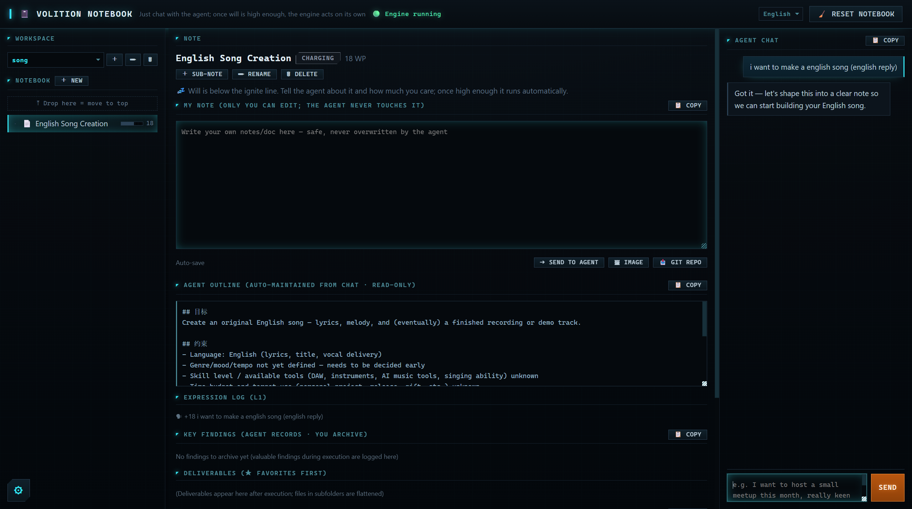

# 愿力引擎 · Volition Engine

[](README.md)&nbsp;[](README.en.md)



> 让 Agent 从"你问一句、它答一句"，变成"你真正在意的事，它主动帮你推进落地"。

## 这是什么

你在聊天里表达一个想法，就等于给这件事**充了一点电**——我们叫它「愿力」。

想法你越常提、越上心，这件事的电就越足。攒过某个线，Agent 就从被动应答切换到**主动模式**：自己去搜集资料、匹配资源、一步步把事往落地推。反过来，你要是不再提了，电会自然漏掉，它也就慢慢降温、停下来——**它只把力气花在你持续在意的事上**。

## 愿力，就像电

| | 现实里发生什么 | 系统里 |
|---|---|---|
| 🔌 充电 | 你表达、强化一个想法 | 这件事的愿力上涨 |
| 🔋 自放电 | 你很久不提了 | 愿力随时间慢慢漏掉（想法自然淡忘）|
| 🔥 点火 | 你是真的想做这件事 | 电攒够，Agent 转入主动、开始替你干 |
| ⚡ 耗电 | 它持续替你运转 | 运行要耗电，电不够就自动停 |

## 它能帮你做什么

- **主动帮你推进多件事**，并按你在意的程度自动排先后，不用你手动管优先级。
- **一个看板看到它此刻在忙什么**——哪件事在推进、进展到哪、烧了多少劲。
- **多工作区**：每本笔记本互相隔离，引擎跨工作区在后台并行推进。
- **花钱、下单、对外发消息这类现实动作，一定先问你批准**，绝不自作主张动你的钱和资源。
- **你随手写的笔记和文档，就是它干活的纲要**——写下来，它下一步就照着调整。
- **始终对齐你真实的意思**，一旦跑偏，会主动回来跟你确认，而不是闷头做错。

## 快速开始

```bash
cd demo
node server.mjs          # 打开 http://localhost:5179
```

- 判断/对话层默认走 **Claude Code 订阅**（免 API Key），也可切到 **Anthropic API**。
- 详细部署（依赖、两种计费模式、数据布局、安全、排错）见 **[docs/DEPLOY.md](docs/DEPLOY.md)**。

## 了解更多

- [部署指南 docs/DEPLOY.md](docs/DEPLOY.md) —— 怎么装、怎么配、怎么排错。
- [设计文档 docs/DESIGN.md](docs/DESIGN.md) —— 完整机制：愿力怎么算、怎么激发、怎么防跑偏。
- [前端设计 docs/FRONTEND.md](docs/FRONTEND.md) —— 看板长什么样、怎么写笔记指挥它。

> **可本地部署的开源项目**——自己部署、接入自己的 Claude 凭据（订阅或 API Key），数据全在本地。
