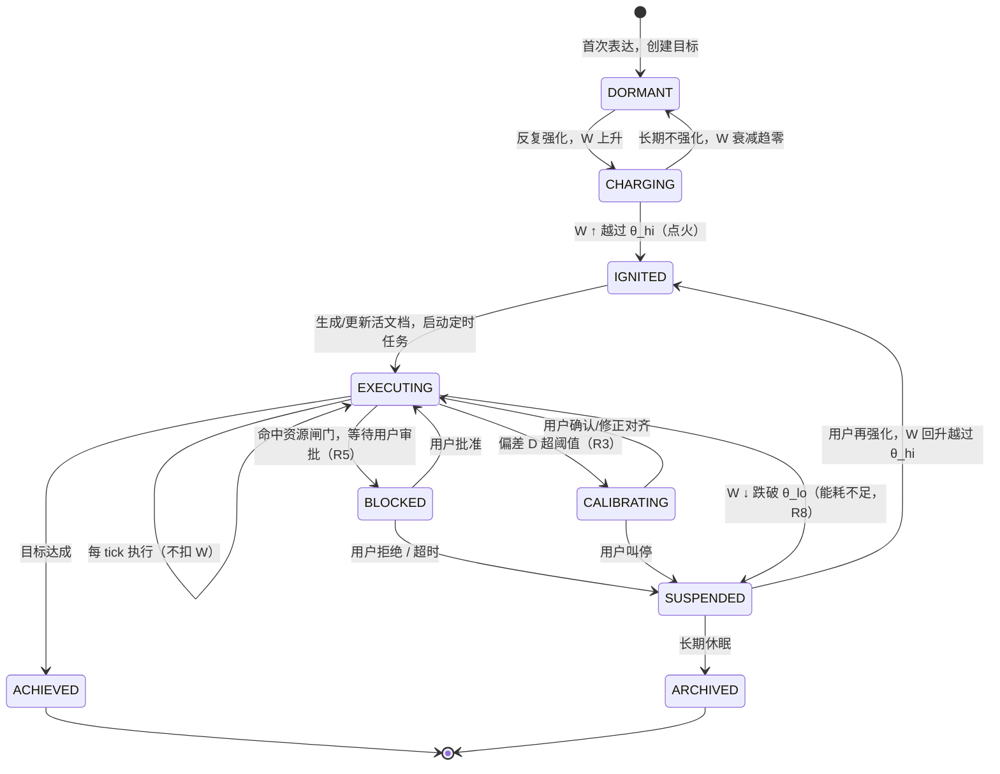
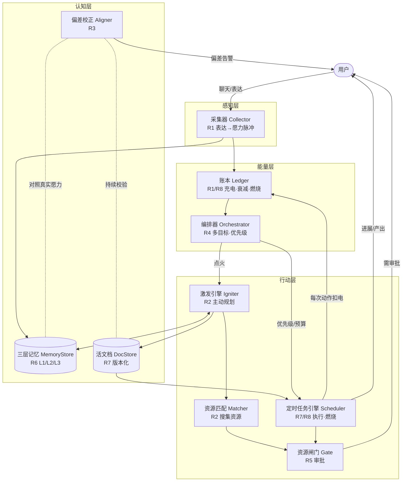
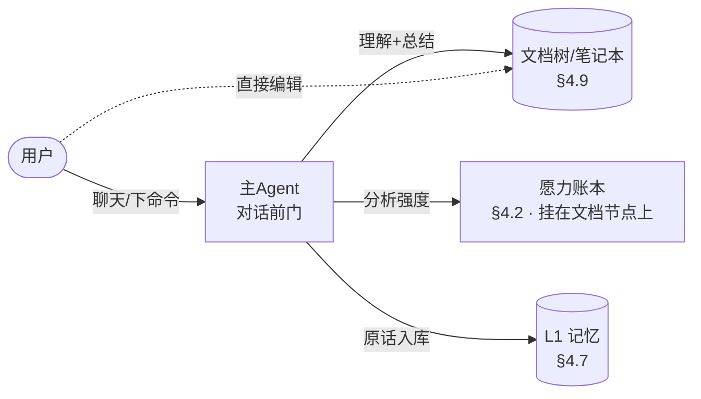
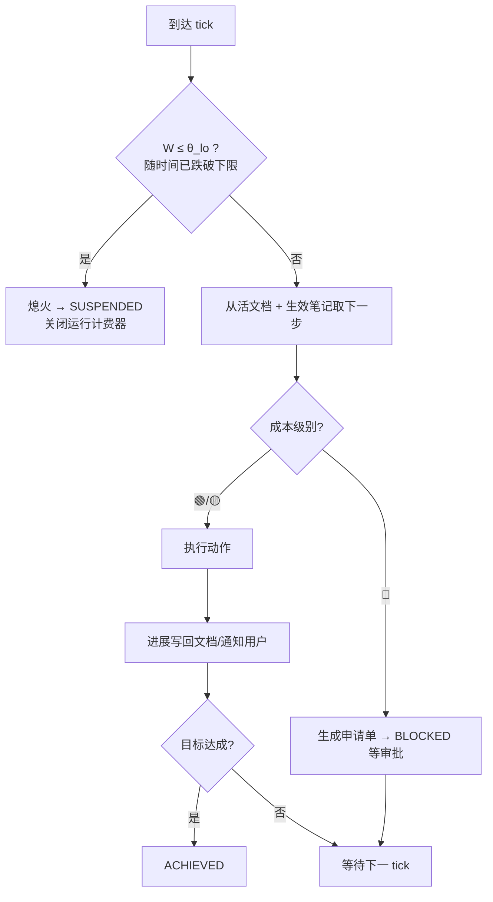
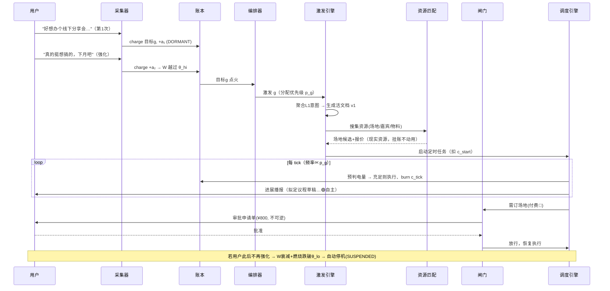

# 愿力引擎 · 系统设计文档（v0.1）

- **代号**：Volition Engine
- **状态**：设计草案，待评审对齐
- **读者**：架构 / 产品 / 后续实现者
- **仓库**：`git@github.com:tmp-chainopera/volition-engine.git`

---

## 0.0 项目动机（为什么要做这套框架）

一句话：**在增强 Agent 自主执行力的同时，约束它对人类指令的执行不发散。**

自主 Agent 有两个天然矛盾的诉求：
- **要更强的自主性** —— 能主动搜集资源、持续推进、不用人事事催。
- **又不能跑偏** —— 越自主越容易"自说自话地替用户做主"，偏离用户真实意图。

本框架用**两条护栏线**同时按住这两端：

| 护栏 | 作用 | 对应机制 |
|------|------|----------|
| **聚焦线**（能量约束） | 让 Agent 只在用户真正持续在意的事上发力，且做功要付出能量代价 | 愿力充电/衰减/燃烧（§2）、动态优先级（§2.5）、能耗自动停机（§4.10）|
| **对齐线**（意图约束） | 让 Agent 的每一步都可溯源到用户真实意图，跑偏即刹车 | 三层记忆权威（§4.7）、偏差校正回路（§4.6）、资源审批闸门（§4.8）|

> 换言之：**愿力管"该不该做、值不值得烧电"，记忆与校正管"做的是不是用户真正要的"。** 两条线合起来，才是"强执行 + 不发散"。

---

## 0.1 需求覆盖速查（R1–R9）

| # | 需求 | 对应设计 |
|---|------|----------|
| R1 | 愿力采集 + 自然衰减 + 反复强化 | §2 愿力动力学 · §4.1 采集器 · §4.2 账本 |
| R2 | 阈值激发态 + 主动搜集匹配资源 | §3 状态机 · §4.4 激发引擎 · §4.5 资源匹配 |
| R3 | 偏差校正机制 | §4.6 偏差校正回路 |
| R4 | 多目标并行 + 动态优先级 | §2.5 优先级公式 · §4.3 编排器 |
| R5 | 现实/付费/高成本资源必须审批 | §4.8 资源闸门（"炒菜机器人"模型）|
| R6 | 记忆三层隔离 + 来源标签 → 执行优先级 | §4.7 三层记忆 |
| R7 | 版本化文档（+笔记）作纲要 + 定时任务引擎 | §4.9 文档载体 · §4.10 调度引擎 |
| R8 | 执行不扣愿力；愿力只随时间衰减，跌破下限自动停 | §2.3 停机核算 · §4.10 调度引擎 |
| R9 | 前端看板展示执行任务 + 笔记/编辑 | 见 [FRONTEND.md](FRONTEND.md) |

---

## 0.2 部署形态：可本地部署的开源项目

- **自部署 + 自带凭据（BYO）**：每个用户在本地跑一份，接入**自己的** Claude 凭据（订阅登录或自己的 API key）。项目不做中心化托管、不转售访问——因此"用户拿自己的订阅驱动自己机器上的 Agent"是正当使用（本质等同本机跑 Claude Code），订阅方案在此成立。
- **存储本地优先**：愿力账本、三层记忆、活文档、笔记均用本地 DB（如 SQLite）+ 本地文件，不假设云数据库；前端看板（[FRONTEND.md](FRONTEND.md)）是本地 web 应用。
- **`LLMBackend` 是一等可配置项**（详见 §4.11.3）：用户在配置中选「订阅登录 / API key / CMA」。
- **后端额度撞限 ≠ 愿力停机**：订阅有 5 小时滚动 + 每周上限，撞限时 Scheduler 应**优雅退避**（降频/暂停 tick 并提示用户），这是**外部故障态**；愿力自动停机（§2.3）是**产品逻辑**。二者在 UI 与日志中必须区分，别让用户误以为是愿力烧完。

---

## 0. 设计哲学：把"愿力"当作能量守恒的物理量

传统 Agent 是「请求—应答」的无状态工具。本框架的根本转变是：**引入一个贯穿全生命周期的标量能量——愿力（Will-Power, `W`）**，让 Agent 的行为由这块"电池"的电量驱动，而不是由单次对话驱动。

一条设计主线（能量守恒直觉）串起了 R1、R2、R8：

```
      用户表达（充电）                         执行做功（放电）
   ┌──────────────────┐                    ┌──────────────────┐
   │  愿力脉冲注入 +ΔW │ ───►  愿力 W(t) ───►│ 定时任务燃烧 −ΔW  │
   └──────────────────┘        │           └──────────────────┘
                               │ 自然衰减 −λW（自放电）
                               ▼
                        低于下限 → 自动停机
```

由此自然涌现四个我们**想要**的性质：

1. **反映真实在意程度**：用户越持续表达/强化，某目标电量越高 → Agent 越优先、越主动。
2. **自动遗忘**：不再被提起的想法会自放电衰减，Agent 不会永远纠缠一个过期意图。
3. **防失控**：Agent 不能凭一句话无限运行——做功要烧电，电量耗尽自动停机（R8）。
4. **免调度饥饿**：多目标按电量归一化分配算力（R4），强意图拿到更多 tick。

> 关键口号：**愿力既是蓄力能源，也是执行做功的能耗来源。用户的"持续在意"就是燃料。**

---

## 1. 名词表（Glossary）

| 术语 | 代号 | 含义 |
|------|------|------|
| 愿力 | `W` | 核心能量标量，单位 **愿点 (WP)**，`W ≥ 0` |
| 愿力脉冲 | `impulse` | 用户一次表达注入的一份意图能量，带初始幅度与时间戳 |
| 目标 / 意图 | `goal` | 用户想落地的一件事，是愿力的归属容器 |
| 激发态 | `IGNITED` | 电量越过上阈值，Agent 由被动转主动 |
| 愿力账本 | Ledger | 记录每一笔充电/衰减/燃烧的能量流水 |
| 活文档 | LDD (Living Design Doc) | 版本化设计文档，Agent 的执行载体（R7）|
| 三层记忆 | L1/L2/L3 | 原话层 / 共编层 / 认可层（R6）|
| 资源闸门 | Gate | 现实/付费/高成本资源的审批关卡（R5）|
| 偏差 | `D` | Agent 计划意图与用户真实愿力的语义距离（R3）|

---

## 2. 愿力动力学（核心数学模型）

> 覆盖 R1（采集/衰减/强化）、R4（优先级）、R8（能耗）。

### 2.1 愿力的构成：脉冲叠加

每个目标 `g` 的**毛愿力**由历史上所有愿力脉冲叠加而成。每个脉冲 `i` 独立衰减：

```
w_i(t) = a_i · 0.5 ^ ( (t − t_i) / T_half )      # 半衰期衰减
W⁺_g(t) = Σ_i  w_i(t)                            # 毛愿力（充电侧）
```

- `a_i`：脉冲初始幅度（充电量），由采集器从表达中估计（见 §4.1）。
- `t_i`：脉冲注入时刻。
- `T_half`：半衰期（可按目标类型/用户配置，如默认 7 天）。

**为什么用脉冲叠加而不是单一标量？**
- 天然实现"反复强化"：再次表达 = 注入新脉冲，总和被顶起来，抵抗衰减。
- 可解释：能追溯"这份电量来自哪几次表达"，为偏差校正（R3）与来源标签（R6）提供锚点。

### 2.2 愿力 = 充电脉冲的衰减叠加（执行不扣减）

```
W_g(t)  = Σ_i a_i · 0.5^((t−t_i)/T_half)         # 愿力 = 历史充电脉冲的半衰期叠加
```

**愿力唯一的减少方式是随时间衰减。执行任务【不】消耗愿力。**
- 愿力代表"用户此刻有多想推这件事"。用户不再表达 → 脉冲随时间淡出 → 愿力自然下降。
- Agent 做功不扣愿力——"在意"不会因为被满足而减少；它只会随时间淡忘。
- （做功仍有真实的 token/成本，但那是"钱"，不是"愿力"；能耗核算见 §2.3。）

### 2.3 停机核算（R8）：愿力随时间衰减，跌破下限自动停

**关键澄清**：执行任务**不**消耗愿力。愿力唯一的减少来源是**随时间自然衰减**（§2.2）。R8「能耗不足自动停机」在本模型里的含义是：**当愿力随时间衰减到停机线 `θ_lo` 以下，引擎自动停止执行该目标。**

```
当  W_g(t) ≤ θ_lo （随时间衰减跌破下限）:
        stop(goal)      # 熄火 → SUSPENDED
```

- 一个目标被充到激发态后，引擎会**周期性**执行它（执行不扣愿力），直到时间把愿力冲淡到 `θ_lo` 以下才停。
- 要让 Agent 持续为你做事 = **持续"在意"、反复表达**给它补充愿力，对抗衰减。你一旦不再在意，它随时间淡出、自动停。
- **执行节奏用「冷却间隔」控制**（同一目标两次执行的最小间隔 `cooldownSec`），而不是用能耗——因为执行不再烧愿力，需要冷却避免连续轰炸。愿力强弱决定**优先级**（R4：越强越常被翻牌）与**是否执行**（激发/停机）。

> 真实的 token/金钱成本仍然存在（见 §4.11 计费），但它与"愿力"解耦：愿力衡量"意志"，成本衡量"钱"。

### 2.4 激发阈值与迟滞（R2）

用**双阈值迟滞**避免在临界点反复横跳（点火/熄火抖动）：

```
点火：W_g ↑ 越过 θ_hi   →  进入 IGNITED（Agent 转主动）
休眠：W_g ↓ 跌破 θ_lo   →  进入 SUSPENDED（停止主动，任务熄火）
                            θ_lo < θ_hi
```

### 2.5 动态优先级（R4）

多目标并行时，算力/注意力预算按**净愿力归一化**分配：

```
p_g = W_g / Σ_{h ∈ 激发中}  W_h          # 优先级权重，随愿力强弱实时变化
```

调度器据此决定每个目标的 tick 频率（cron 档位）与并发资源份额：

```
tick_cadence(g) = 档位映射( p_g )         # 如 p 高→每5分钟；p 低→每天
```

> 优先级不是用户手动排的，而是"愿力强弱"自然涌现出来的（R4）。

---

## 3. 目标生命周期状态机

> 覆盖 R2（激发）、R8（能耗停机）。每个目标独立跑一台状态机；多目标并行 = 多台状态机同时运行（R4）。



**状态语义要点**
- `DORMANT/CHARGING`：Agent **被动**——只收集愿力、澄清、共编文档，不主动做事。
- `IGNITED/EXECUTING`：Agent **主动**——搜集匹配资源、推进落地（R2）。
- `BLOCKED`：撞上现实/付费资源，挂起等审批（R5）。
- `CALIBRATING`：怀疑跑偏，暂停高成本动作，回头找用户校准（R3）。
- `SUSPENDED`：熄火但可复活（再强化即可，R8 的可逆性）。

---

## 4. 系统架构与子系统

### 4.0 总览



九大子系统，逐一展开。

---

### 4.1 主Agent 与采集器（R1 · 对话 → 文档 + 愿力）

**核心形态：主Agent 是对话前门。** 用户不「手动充值愿力」——而是**跟主Agent 聊天、下命令**，主Agent 一边对话，一边完成三件事：

1. **理解意图**：从对话中识别「用户想做的事」，归属到既有文档节点或新建节点。
2. **成文**：把想做的事**总结为文档**，写入文档树（§4.9）。文档是可编辑的、嵌套的（笔记本式）。
3. **赋予愿力**：分析这轮表达的强度，给对应文档节点**赋予/追加愿力**（幅度估计见下）。



> 主Agent = 采集器（估愿力）+ 激发引擎（成文，§4.4）在会话层的融合。愿力**按文档节点归属**（每个「想做的事」各有自己的愿力，对应多目标 R4）。

**采集器职责**（主Agent 内部）：从每轮表达中，(a) 识别/归属到文档节点，(b) 估计愿力脉冲幅度 `a_i`，(c) 沉淀 L1 原话记忆。

**幅度估计** `a_i`（把"表达"翻译成"充电量"）：

```
a_i = a_base · f_情绪(sentiment) · f_明确(specificity) · f_显式(explicit_weight) · f_重复(recency_repeat)
```

| 因子 | 信号来源 | 直觉 |
|------|----------|------|
| 情绪强度 | 语气、感叹、迫切措辞 | "我特别想…" > "随便看看" |
| 明确度 | 目标是否具体可执行 | 具体 > 模糊愿望 |
| 显式加权 | 用户明说重要性/截止 | "这个最重要""下周要" |
| 重复度 | 近期是否反复提 | 反复提 = 主动强化 |

**目标归属**：新表达先做语义匹配到既有目标；相似 → 注入脉冲到该目标（强化）；不相似 → 新建目标（DORMANT）。归属决策与置信度写入账本，供偏差校正复查。

**输出**：`impulse{goal_id, a_i, t_i, source_ref→L1}`。

---

### 4.2 愿力账本 Ledger（R1/R8 · 能量核算）

**职责**：唯一的能量真相源。记录并可回放每一笔能量流水。

**能量流水条目**：

```jsonc
{
  "goal_id": "g_123",
  "type": "charge | decay | burn",     // 充电 / 衰减 / 燃烧
  "amount": 12.5,                        // WP，正=充电，负=放电
  "reason": "user_reinforce | half_life | task_running | task_start | task_stop",
  "ref": "impulse_88 | run_span_1712..1830",   // 溯源(强化脉冲 / 运行时段)
  "ts": "2026-07-18T09:00:00Z",
  "balance_after": 63.2
}
```

**对外提供**：
- `W_g(now)`：按 §2 公式实时计算净愿力（懒计算，不必每秒刷）。
- `burn(goal, amount, reason)`：由**运行计费器按时间**调用（`amount = r_burn·Δt`），而非每个动作调用；返回是否触发自动停机。
- `charge(goal, impulse)`：采集器调用，注入脉冲。
- 能量曲线：供 UI 展示"这件事的热度趋势"。

> 衰减不必真的定时扣减——采用**惰性求值**：`W⁺` 是脉冲叠加的解析式，任意时刻直接算，避免海量定时写。仅"燃烧 `B`"是事件驱动累加。

---

### 4.3 编排器 Orchestrator（R4 · 多目标并行 + 动态优先级）

**职责**：俯瞰所有激发中的目标，按 §2.5 计算 `p_g`，把有限的算力/并发/tick 频率分配下去。

- 维护激发目标集合，实时重算优先级权重（愿力变 → 权重变 → 调度档位变）。
- 设**全局并发上限**与**全局能耗预算**（防止 N 个目标同时烧钱）。当预算紧张时，低 `p_g` 目标降档甚至挂起。
- 处理目标间**资源竞争**：同一现实资源被多目标争用时，按 `p_g` 排序 + 走闸门。

---

### 4.4 激发引擎 Igniter（R2 · 被动 → 主动）

**触发**：目标越过 `θ_hi` 点火时被编排器唤醒。

**职责**：把"用户想要的事"翻译成"可执行的活文档"：
1. 从三层记忆聚合该目标的真实意图（L1 优先，见 §4.7）。
2. 产出/更新**活文档 LDD**：目标陈述、约束、里程碑、行动计划（每步打记忆来源标签）、资源需求清单。
3. 拆解出需要搜集的资源，交给 Matcher。
4. 高成本步骤预标记，走 Gate 审批。

> Igniter 只负责"规划"，不直接动手做高成本动作——动手由 Scheduler 按文档执行，且受 Gate 约束。

---

### 4.5 资源匹配 Matcher（R2 · 主动搜集匹配资源）

**职责**：激发态下主动去"找米下锅"。资源分两类通道：

| 资源类型 | 例子 | 通道 |
|----------|------|------|
| 信息/虚拟资源 | 资料、模板、公开数据、可调用 API | 自主搜集匹配 |
| 现实/付费/实体资源 | 采购原材料、付费服务、约人、下单 | 只做**候选发现 + 报价**，落地走 Gate（R5）|

**产出**：把匹配到的资源挂到活文档的"资源需求"项上，标注：来源、可得性、成本、是否需审批。**发现 ≠ 使用**——现实资源一律先挂账、后审批。

---

### 4.6 偏差校正回路 Aligner（R3）

**职责**：持续校验"Agent 的行动规划"是否偏离"用户真实愿力"。这是一条独立于执行的**反馈控制环**。

**偏差度量**：

```
真实愿力向量  V_true = embed( L1原话  ⊕  加权L2共编 )      # 以用户侧为准
计划意图向量  V_plan = embed( 当前活文档的目标/行动步骤 )
偏差         D_g   = 1 − cos_sim(V_true, V_plan)          # 越大越跑偏
```

**三重校验**（不只靠语义相似度）：
1. **语义偏差**：`D_g > δ` → 进入 `CALIBRATING`，暂停高成本动作，向用户抛校准问题（"我理解你想要 X，对吗？"）。
2. **来源接地检查**：活文档每个行动步骤必须至少引用一条记忆来源；**仅由 L3（Agent 自主生成）支撑、且接地置信度低**的步骤，标记为高漂移风险，禁止驱动高成本执行。
3. **前置反问闸**：任何高成本/不可逆动作执行前，强制生成一次"意图确认卡"给用户（与 Gate 协同）。

**校准时机**：里程碑切换、重大版本变更、高成本动作前、以及周期性巡检。校准结论写入活文档的"偏差校正日志"，形成可审计轨迹。

---

### 4.7 三层记忆 MemoryStore（R6 · 隔离存储 + 来源标签 → 执行优先级）

**三层物理/逻辑隔离**，每条记忆带来源标签，标签决定**执行时的采信优先级**：

| 层 | 名称 | 内容 | 采信优先级 | 可否驱动执行 |
|----|------|------|-----------|-------------|
| **L1** | 原话层 | 用户原始原话，逐字保留、不可被改写 | **最高**（权威） | 是，最高权威，不可被 L3 覆盖 |
| **L2** | 共编层 | 用户与 Agent 共同编辑确认的内容 | 高 | 是 |
| **L3** | 认可层 | Agent 自主生成、**且用户完全认可**的内容 | 中 | 是（但不得压过 L1/L2）|
| L3⁻ | 认可候选 | Agent 自主生成、**未获认可** | 最低 | **否**——只能建议，不能驱动执行 |

**记忆条目结构**：

```jsonc
{
  "id": "m_501",
  "goal_id": "g_123",
  "tier": "L1 | L2 | L3 | L3-candidate",
  "source": "user_verbatim | co_edited | agent_generated",
  "approval": { "status": "approved | pending | rejected", "by": "user", "ts": "..." },
  "content": "……",
  "provenance": ["impulse_88", "doc_v3#step2"],   // 溯源链
  "immutable": true                                // L1 恒为 true
}
```

**冲突消解规则**（执行时若多条记忆冲突）：
```
L1 > L2 > L3 > L3-candidate
同层则新覆盖旧；L1 永不被下层覆盖，只能被用户新的原话更新。
```

> 关键约束：**Agent 自主生成的内容在"用户认可"之前，永远停留在 L3-candidate，不能进入执行链。** 这是防止 Agent"自说自话地替用户做主"的护栏。

---

### 4.8 资源闸门 Gate（R5 · 炒菜机器人模型）

**类比**：炒菜机器人能规划菜谱，但**没有食材就做不出菜**，而且"买食材、开火"这类动作必须先问主人。

**资源分级与放行策略**：

| 级别 | 特征 | 例子 | 策略 |
|------|------|------|------|
| 🟢 自主 | 虚拟/免费/可逆/零现实影响 | 搜索、起草、内部计算 | 直接执行 |
| 🟡 告知 | 低成本/可逆/轻现实影响 | 发一封草稿待你确认、占位预约 | 执行 + 事后告知 |
| 🔴 审批 | **现实实体 / 付费 / 高成本 / 不可逆** | 下单采购、付款、对外发送、约人、动用物理设备 | **强制审批闸门，阻塞等待** |

**审批申请单（Requisition）**：

```jsonc
{
  "goal_id": "g_123",
  "action": "purchase_ingredient",
  "what": "采购 A 材料 x3",
  "why": "活文档 v4 里程碑2 需要",
  "cost": { "money": 320, "currency": "CNY", "irreversible": true },
  "alternatives": ["更便宜的替代品 B（品质略低）", "暂缓"],
  "will_snapshot": 58.4,        // 当下该目标愿力，供用户判断值不值
  "expires_at": "..."           // 超时→回落 SUSPENDED
}
```

- 命中 🔴 → 目标进入 `BLOCKED`，生成申请单推给用户，**任何现实资源在批准前一律不得动用**。
- 批准 → 恢复 `EXECUTING`；拒绝/超时 → `SUSPENDED`。
- 审批记录写入活文档，形成消费/授权审计轨迹。

---

### 4.9 文档树 DocStore（R7 · 笔记本式嵌套文档 = 执行纲要）

**核心形态：文档是一棵可嵌套的树（笔记本）。** 不是一个扁平文件，而是**有目录、能嵌套**的文档树——像笔记本一样组织多件"想做的事"及其子事项。

```
📓 我的愿力笔记本
├── 📄 办一场线下分享会         W=58  [激发]     ← 一个"想做的事" = 一个可执行节点
│   ├── 📄 定场地               W=—   (继承父)
│   └── 📄 拟嘉宾名单           W=—
├── 📄 读完《XXX》              W=12  [蓄力]
└── 📁 灵感散记                              ← 纯目录/笔记，不一定可执行
    └── 📝 随手想法…
```

- **每个文档节点**都是一份纲要（目标/约束/行动计划/资源），可独立被 Scheduler 执行（§4.10）。
- **愿力挂在节点上**：每个"想做的事"各有自己的愿力（多目标 R4）；子节点可继承或独立计愿力。
- **两种来源、都可编辑**：主Agent 从对话中**总结生成/更新**节点（§4.1）；**用户也能直接编辑**任何节点（人机共编，来源标签见 §4.7）。
- **像笔记**：节点内容自由（Markdown），可嵌套、可拖动重组；结构本身就是"我在意哪些事、怎么分层"的表达。

**核心理念**：Agent 的执行不看"对话历史"，而看**文档树里当前节点的内容**（正式纲要 + 随手笔记合一）——每个 tick 都以它为准绳。

**文档 vs 笔记：两种纲要，互补分工**

| | 活文档 LDD | 笔记 Note |
|---|-----------|-----------|
| 形态 | 结构化（里程碑/行动步骤/资源） | 自由文本，轻量随手写 |
| 定位 | 正式执行契约 | 用户随时补充的意图/约束/灵感 |
| 版本 | 强版本化（diff 链、可回滚） | 版本化（保留修改历史）|
| 来源 | 用户改→L1/L2；Agent 提议→L3-candidate | 用户写→L1；共编→L2 |
| 对执行 | 决定"做什么、按什么里程碑" | 补充"怎么做、别踩什么、优先照顾什么" |

**笔记如何参与执行**（关键：笔记是纲要，不是备忘录）：
1. 用户在前端写下的笔记，作为 **L1 原话/L2 共编** 记忆入库，享最高采信优先级（§4.7）。
2. Igniter 生成/修订活文档时，**必须把相关笔记聚合进意图**；笔记里的约束（"别超预算""先照顾 A"）直接转成活文档的约束项与行动步骤排序。
3. Scheduler 每 tick 读取"当前活文档 + 生效笔记"作为执行依据；用户新写的笔记会即时改变后续 tick 的行为。
4. 笔记与活文档冲突时，按记忆层级消解：用户笔记（L1）> Agent 生成的文档步骤（L3）。这也是"指令不发散"的一道闸——**用户随手一条笔记就能把跑偏的执行拉回来**。

**核心理念（续）**：文档是意图与执行之间的正式契约，笔记是用户对执行的实时微调。二者都版本化、都可溯源、都能驱动或纠正执行。

**单个节点的文档结构**（树里每个可执行节点一份）：

```
# 活文档 LDD · node n_123 · v4
## 目标陈述        ← 溯源 L1/L2
## 约束与边界      ← 预算、时间、红线
## 里程碑          ← M1 / M2 / M3
## 行动计划        ← 每步：{描述, 记忆来源标签, 资源需求, 成本级别, 状态}
## 资源需求清单    ← Matcher 挂载，标注是否需审批
## 审批记录        ← Gate 写入
## 偏差校正日志    ← Aligner 写入
## 变更历史        ← v1→v2→…→v4 diff
```

**版本规则**：
- 每次实质变更产生新版本（immutable diff 链），旧版本可回滚、可审计。
- **谁能改文档**：用户可直接改（→ L1/L2）；Agent 提议改（→ 先入 L3-candidate，用户认可后并版 → L3/L2）。
- 版本切换会触发 Aligner 复查偏差、Orchestrator 重估资源需求。

> 文档即状态：即使系统重启、上下文丢失，Agent 也能靠"当前版本文档 + 账本电量"无缝续跑。

---

### 4.10 定时任务引擎 Scheduler（R7/R8 · Agent 本体）

**核心定位**：**Agent 本身就是一台定时任务引擎**，依照活文档内容周期性做功。

**两条解耦的循环**：能耗按时间烧（后台计费器），做功按 tick 触发（执行器）。二者分离，正对应"能耗随时间、不随动作"（§2.3）。

**① 运行计费器（后台，随时间）**：目标处于 EXECUTING 期间常驻，按经过的时间持续 `Ledger.burn(r_burn · Δt)`；一旦 `W ≤ θ_lo` 即熄火。与是否正在做动作无关。

**② 做功执行器（每 tick）**：



- **能耗只由计费器①按时间扣**（R8）；执行器②只负责做功、不直接扣能耗。触发进入运行态=打开①，停止=关闭①。
- tick 频率由 Orchestrator 依 `p_g` 下发（R4）。tick 更密只是"做功更勤"，不改变"按时间烧"的能耗口径（不过更高资源等级会抬高 `r_burn`）。
- 与外部触发器（如现有 AgentSwarm triggers 体系）对接的抽象层预留在此：`Scheduler` 只依赖一个 `TriggerSource` 接口，可换 cron / 事件 / 外部 trigger。

---

### 4.11 大模型调用层 LLM Layer（Agent 的"大脑"用什么）

**Agent 的智能来自大模型调用，分两类；Claude Code 主要承接"执行"这一类。**

| 调用类型 | 场景 | 手段 |
|----------|------|------|
| **判断类**（无需工具） | 愿力幅度估计（§4.1）、偏差打分（§4.6）、意图聚合、审批申请单文案 | Claude **Messages API** + 结构化输出（`output_config.format`），模型 `claude-opus-4-8`。一次请求一个结构化结果，可解释、好落账。 |
| **执行类**（需工具/文件/MCP） | Scheduler 每 tick 的做功——改活文档、搜集资源、推进落地 | **Claude Code 作为执行引擎**（见下）。 |

**执行类：把 Claude Code 当引擎的两条路**

**① Claude Agent SDK（推荐用于 MVP）** —— Claude Code 封装成库（`@anthropic-ai/claude-agent-sdk` / `claude-agent-sdk`），**自托管**。Scheduler 每 tick 调一次 `query(prompt, options)`：
- 把「当前活文档 + 生效笔记」作为工作目录/上下文喂入（正对 §4.9 纲要）；
- SDK 自带 read/write/edit/bash/web/grep + MCP + 子代理，直接改文档、找资源、落地；
- 高成本动作命中 §4.8 闸门 → 挂起等审批；
- **愿力账本、燃烧、自动停机、状态机全在本框架这侧**，控制力最强，且与现有 AgentSwarm/triggers 好对接。

**② Managed Agents (CMA)** —— Anthropic 托管 agent loop + 每会话沙箱。几个能力与需求高度重合：

| CMA 能力 | 对应需求 |
|----------|----------|
| scheduled deployments（cron 触发、每次自动开 session） | R7「Agent 本身是定时任务引擎」 |
| permission policies（`always_ask` → `tool_confirmation`） | R5 资源审批闸门 |
| memory stores（跨会话持久记忆） | R6 三层记忆的持久层 |

代价：少运维，但 **CMA 不认识"愿力"——能耗核算/衰减/自动停机仍须在本框架这侧实现**。

**取舍（并入 §7 Q6）**：MVP 走 ① 自托管，判断类走 Messages API 结构化输出；②CMA 作为后续"托管化"备选。注意 Claude Agent SDK 是独立产品，实现细节以其官方文档为准。

#### 4.11.1 分工边界：本框架 vs Claude Code（别重复造轮子）

Claude Code / Agent SDK 已内建上下文管理、compaction、prompt caching、agentic 循环、工具编排、子代理、权限钩子、会话续跑——**这些一律交给它，不自己重写**。本框架只实现 Claude Code 没有的"新陈代谢 + 长期意志"层。

| 交给 Claude Code（别自己造） | 本框架自己实现（Claude Code 没有） |
|---|---|
| 单次 tick 的 agentic 循环、工具编排 | 愿力充电 / 衰减 / **按时间燃烧** / 自动停机（§2、§4.2） |
| **上下文管理 + compaction** | 目标生命周期状态机（§3） |
| prompt caching | 多目标动态优先级编排（§4.3） |
| 文件 read/write/edit、bash、web、MCP | 三层记忆的**权威语义**（L1>L2>L3，§4.7） |
| 会话续跑、子代理 | 偏差校正回路（§4.6） |
| 权限钩子（可接 §4.8 资源闸门） | 版本化活文档 + 笔记的**治理**（谁能改、认可流，§4.9） |

#### 4.11.2 tick 播种策略：别跟 Claude Code 的压缩抢

- Claude Code 的上下文/compaction 是**一次 tick（一个 session）内部**的短期记忆；愿力引擎的长期记忆是**活文档 + 笔记 + 三层记忆**这套持久纲要。
- 每个 tick：本框架从「当前活文档 + 生效笔记 + 相关记忆（按 L1>L2>L3）」**播种上下文** → Claude Code 在 tick 内自管上下文膨胀 → 产出**版本化写回**文档（§4.9）。
- 由此"文档即状态"（§4.9）与来源权威（§4.7）不被 Claude Code 的内部压缩破坏。
- **开放问题（并入 §7）**：每个目标是「每 tick 起新 session 重播种」还是「长驻可续跑 session 靠 Claude Code 保上下文」？前者防跑偏更稳、文档权威清晰；后者更省 token。倾向：长驻续跑省成本，但活文档/笔记发生实质变更或触发偏差校正时强制重播种。

#### 4.11.3 计费通道与执行引擎解耦

**用 Agent SDK 当执行引擎，与"订阅 vs API"是两个独立决策。** Scheduler 只依赖一个 `LLMBackend` 抽象；其实现可为：订阅登录（个人/单人用，最省，但受 5 小时滚动 + 每周额度限制，且不适合对外多用户产品）/ API key（产品化、可计量，配合 caching+Haiku+Task Budget 压成本）/ CMA。MVP 用订阅验证愿力闭环，产品化再换 API，业务逻辑不动。

---

## 5. 端到端流程示例

**场景**：用户反复念叨"我想在下个月办一场小型线下分享会"。



---

## 6. 关键接口（技术无关伪签名）

```text
// 采集
Collector.ingest(utterance) -> Impulse | null

// 能量
Ledger.charge(goal_id, impulse)
Ledger.burn(goal_id, amount, reason) -> { balance, auto_stopped: bool }
Ledger.will(goal_id, at=now) -> W

// 编排
Orchestrator.priorities() -> { goal_id: p_g }
Orchestrator.cadence(goal_id) -> TriggerSpec

// 激发/规划
Igniter.ignite(goal_id) -> DocVersion
Matcher.find_resources(goal_id) -> [ResourceCandidate]

// 偏差
Aligner.drift(goal_id) -> { D, grounded: bool, flags: [...] }

// 记忆
MemoryStore.write(entry)                 // 强制带 tier + source
MemoryStore.resolve(goal_id, query) -> [entry]  // 按 L1>L2>L3 排序返回
MemoryStore.promote(candidate_id)        // 用户认可: L3-candidate -> L3

// 闸门
Gate.check(action) -> GREEN | YELLOW | RED
Gate.request(requisition) -> approval_future

// 文档
DocStore.current(goal_id) -> LDD
DocStore.propose_revision(goal_id, patch) -> candidate   // 待认可
DocStore.commit(goal_id, candidate) -> DocVersion

// 调度（Agent 本体）
Scheduler.attach(goal_id, TriggerSource)
Scheduler.on_tick(goal_id)               // 见 §4.10 循环
```

---

## 7. 设计取舍与开放问题（待评审拍板）

| # | 问题 | 备选 | 倾向 |
|---|------|------|------|
| Q1 | 愿力幅度 `a_i` 靠 LLM 打分还是规则？ | LLM 语义评分 / 规则加权 / 混合 | 混合：规则托底 + LLM 校准，可解释 |
| Q2 | 衰减用半衰期还是线性？ | 指数(半衰期) / 线性 / 幂律 | 半衰期，符合"越久越淡且不归零太快" |
| Q3 | 能耗单位是抽象 WP 还是绑定真实成本(¥/token)? | 纯抽象 / 绑定真实 | 抽象 WP 为主，真实成本经 `κ` 折算入 `resource_cost` |
| Q4 | 偏差向量的 embedding 与阈值 `δ` 如何标定？ | 需数据校准 | 先经验值 + 用户校准反馈在线调 |
| Q5 | 多目标共享现实资源的冲突仲裁 | 按 p_g / 先到先得 / 用户裁决 | 按 p_g 排序 + 冲突升级给用户 |
| Q6 | 与现有 AgentSwarm/triggers 对接边界 | 独立 / 预留接口 | Scheduler 抽象 `TriggerSource`，实现层择机对接 |
| Q7 | 愿力是否可在目标间"转移/借电"？ | 允许 / 禁止 | v0.1 禁止，保持归属清晰；后续再议 |

---

## 8. 里程碑建议（若进入实现）

1. **M1 能量内核**：Ledger + 愿力动力学 + 状态机（可用脚本模拟充电/衰减/燃烧曲线，验证自动停机）。
2. **M2 记忆与文档**：三层 MemoryStore + 版本化 DocStore（跑通"提议→认可→并版"）。
3. **M3 激发闭环**：Collector → Igniter → Scheduler 主动执行（信息类动作，纯 🟢）。
4. **M4 护栏**：Gate 审批 + Aligner 偏差校正接入。
5. **M5 编排**：多目标并行 + 动态优先级 + 全局预算。

---

*本文档为 v0.1 草案。下一步：请就 §7 的 Q1–Q7 拍板，并确认里程碑排序，我再据此细化数据库 schema / 技术栈 / 具体实现。*
