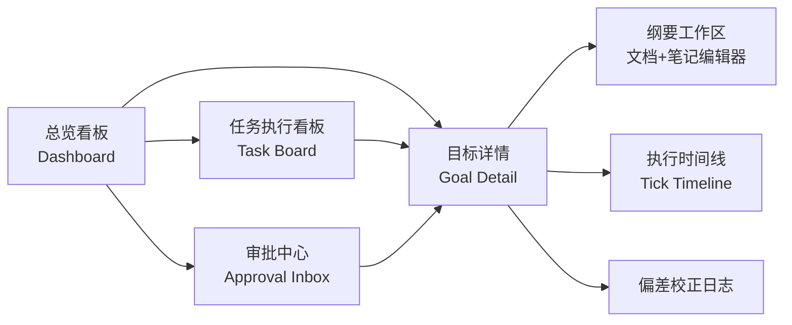

# 愿力引擎 · 前端设计文档（v0.1）

> 配套 [DESIGN.md](DESIGN.md)。前端是用户与愿力引擎交互的窗口：**看 Agent 在执行什么（看板）**、**写笔记/改文档来指挥执行（编辑）**、**审批现实资源、处理偏差告警**。

对应需求（新增）：
- **R9-a** 前端展示看板：展示执行中的任务。
- **R9-b** 前端提供编辑 / 写笔记功能。
- **R9-c** 笔记与文档是执行的纲要（编辑即指挥执行，见 DESIGN §4.9）。

前端同时是"指令不发散"护栏的人机界面：用户随手一条笔记 / 一次审批拒绝，就能把跑偏的执行拉回来。

---

## 1. 信息架构（页面地图）



| 页面 | 回答的问题 | 核心需求 |
|------|-----------|----------|
| 总览看板 Dashboard | 我有哪些愿望？各自多少电、什么状态？ | R2/R4 |
| 任务执行看板 Task Board | **Agent 此刻在执行/排队哪些任务？** | **R9-a** |
| 纲要工作区 Editor | 我怎么写文档/笔记来指挥执行？ | **R9-b/c** |
| 目标详情 Goal Detail | 这件事推进到哪了？愿力怎么变的？ | R1/R7 |
| 审批中心 Approval Inbox | 有哪些现实/付费动作等我批？ | R5 |

---

## 2. 总览看板 Dashboard

每个目标一张卡片，一眼看全"电量 + 状态 + 进展 + 待办护栏"。

```
┌─────────────────────────────────────────────┐
│ 🔥 办一场线下分享会            [执行中 EXECUTING]│
│ 愿力 ▓▓▓▓▓▓▓▓░░ 58 WP   ↓衰减中  优先级 42%   │
│ 里程碑 M2/3 · 定场地中                          │
│ ⚠ 1 项待审批(¥800 订场地)   🎯 偏差 低          │
│ [进入详情]  [写笔记]  [强化 +愿力]              │
└─────────────────────────────────────────────┘
```

**卡片元素**
- **愿力电量条**：净愿力 `W_g` 的电池条 + 趋势箭头（↑充电 / ↓衰减 / 🔥燃烧中）。颜色随状态。
- **状态徽标**：DORMANT / CHARGING / IGNITED / EXECUTING / BLOCKED / CALIBRATING / SUSPENDED（配色见 §6）。
- **优先级 %**：`p_g`，实时。多卡片按 `p_g` 排序。
- **护栏角标**：待审批数（红）、偏差等级（低/中/高）。
- **快捷操作**：进入详情 / 写笔记 / **强化**（一键给这个愿望"充电"，等价再次表达）。

**"强化"按钮**：直接对应 R1 的反复强化——用户点一下或补一句话，采集器注入新脉冲，电量回升、抵抗衰减。看板上能直观看到电量被顶起来。

---

## 3. 任务执行看板 Task Board（R9-a 核心）

**回答"Agent 在执行什么"**。跨所有目标，把定时任务引擎（DESIGN §4.10）正在做的事摊平展示。

三列泳道（按 tick 生命周期）：

```
  排队中 Queued          执行中 Running            近期完成 Done
┌───────────────┐   ┌──────────────────────┐   ┌───────────────┐
│ 分享会·拟嘉宾名单│   │ 分享会·起草议程 🟢    │   │ 分享会·选主题 ✓ │
│  下个tick 08:00 │   │  运行中·-0.5WP/时      │   │  产出:3个候选  │
├───────────────┤   ├──────────────────────┤   ├───────────────┤
│ 读书计划·找书单 │   │ 读书计划·摘要生成 🟢  │   │ ...            │
│  优先级低·每日   │   │  运行中·-0.2WP/时      │   │                │
└───────────────┘   └──────────────────────┘   └───────────────┘
              🔴 阻塞: 分享会·订场地 → 等审批
```

**每个任务条展示**
- 归属目标 + 动作描述 + 资源级别徽标（🟢自主 / 🟡告知 / 🔴审批）。
- 运行态：**燃烧速率（WP/时）+ 已运行时长**（能耗随时间累积，不是每动作扣一次）、实时日志尾巴。
- 排队态：下次触发时间（cron 档位由 `p_g` 决定）、频率。
- 完成态：产出摘要 + 写回了哪个文档版本。
- 阻塞态：单独高亮，一键跳审批。

**实时性**：通过 WebSocket/SSE 订阅 tick 事件流，任务条实时流转泳道、燃烧数字跳动。让"Agent 在做功、在烧愿力"变得可感知（呼应 R8）。

**全局能耗条**：顶部一条"本时段总燃烧 / 全局能耗预算"，预算紧张时提示哪些低优先级目标被降档（DESIGN §4.3）。

---

## 4. 纲要工作区 Editor（R9-b/c 核心）

**理念**：编辑不是记笔记，而是**直接指挥执行**。文档与笔记都是"执行纲要"（DESIGN §4.9），改了就影响后续 tick。

**双区布局**

```
┌───────── 活文档 LDD (结构化) ─────────┬──── 笔记 Note (自由) ────┐
│ ## 目标陈述        [L1]               │ 📝 别超预算 800          │
│ ## 里程碑 M1✓ M2● M3                  │ 📝 嘉宾优先本地的人       │
│ ## 行动计划                           │ 📝 场地要有投影           │
│  1. 选主题 [L1] ✓                     │ [+ 新笔记]               │
│  2. 定场地 [L2] 🔴需审批 ●            │                          │
│  3. 拟议程 [Agent建议·待认可 L3?]     │ 版本: v4 · 3分钟前保存    │
│     [✓认可] [✎改] [✗弃]              │ [查看历史]               │
└──────────────────────────────────────┴──────────────────────────┘
```

**关键交互**
- **来源标签可视化**：每段内容标注 `L1原话 / L2共编 / L3认可 / L3待认可`（DESIGN §4.7），颜色区分。用户一眼看出"哪些是我说的、哪些是 Agent 自己加的"。
- **认可流**：Agent 提议的步骤显示为"待认可(L3-candidate)"，带 `[✓认可] [✎改后认可] [✗弃]`。**未认可的内容不驱动执行**——这是防发散的关键 UI 闸。
- **笔记即时生效**：写下笔记 → 立即作为 L1/L2 入库 → 下个 tick 就照它调整（如"别超预算"会卡住超预算的采购）。
- **版本历史**：文档与笔记都可查 diff、回滚（DESIGN §4.9 版本规则）。
- **冲突提示**：当笔记与文档步骤冲突，UI 高亮并按层级提示"以你的笔记(L1)为准"。

**编辑器技术选型建议**：Markdown/富文本（如 TipTap / ProseMirror），块级来源标签，自动保存 + 版本快照。

---

## 5. 目标详情 / 审批 / 偏差

### 5.1 目标详情 Goal Detail
- **愿力曲线**：把 `W⁺`(充电) − `B`(燃烧) = `W`(净) 三条线画出来，标注每次强化脉冲、运行时段随时间的燃烧、衰减趋势（DESIGN §2）。用户能看懂"为什么这件事凉了/热了"。
- **执行时间线**：按时间列出每个 tick 做了什么、烧了多少、产出什么。
- 内嵌纲要工作区与偏差日志入口。

### 5.2 审批中心 Approval Inbox（R5）
- 列出所有 🔴 申请单（DESIGN §4.8 结构）：做什么、为什么、成本、替代方案、当下愿力快照、过期时间。
- `[批准] [拒绝] [改额度后批准]`。批准→任务恢复 EXECUTING；拒绝/超时→目标 SUSPENDED。
- 醒目展示"不可逆""付费"标记，避免误批。

### 5.3 偏差校正提示（R3）
- 目标偏差升高时，详情页/看板弹校准卡："我理解你想要 X，对吗？" `[对] [不，其实是…]`。
- 用户修正 → 写回 L1/L2 → Agent 重估活文档、偏差回落。这是"指令不发散"的主动兜底。

---

## 6. 视觉语言（状态配色）

| 状态 | 色 | 语义 |
|------|-----|------|
| DORMANT / CHARGING | 灰 / 浅蓝 | 蓄力中，Agent 被动 |
| IGNITED / EXECUTING | 橙 / 火红 | 主动做功，燃烧中 |
| BLOCKED | 黄 | 等审批 |
| CALIBRATING | 紫 | 校准中 |
| SUSPENDED / ARCHIVED | 灰 | 熄火 / 归档 |

愿力用"电量/火焰"意象贯穿：充电=蓄电池，激发=点火，执行=燃烧，停机=熄灭。

---

## 7. 前后端数据流

```mermaid
flowchart LR
    subgraph 前端
      DASH[看板/任务板]
      ED[纲要工作区]
      APP[审批中心]
    end
    subgraph 后端接口 DESIGN §6
      REST[(REST: 目标/文档/笔记/审批 CRUD)]
      WS[(WS/SSE: tick·愿力·状态 实时流)]
    end
    ED -- 保存文档/笔记 --> REST
    APP -- 批准/拒绝 --> REST
    DASH -- 强化+愿力 --> REST
    WS -- tick进展/电量变化/偏差告警 --> DASH
    WS --> ED
    WS --> APP
```

- **写路径（REST）**：编辑文档/笔记、认可 L3-candidate、审批、强化愿力。
- **读/实时路径（WS/SSE）**：任务泳道流转、燃烧数字、愿力曲线、偏差告警——保证"看板反映 Agent 真实执行状态"。

---

## 8. 技术栈建议（待与后端一起拍板）

| 层 | 建议 | 备注 |
|----|------|------|
| 框架 | React + TypeScript | 与你现有 chat-web 同栈，便于复用 |
| 状态/数据 | TanStack Query + WS 订阅 | 实时任务流 |
| 编辑器 | TipTap(ProseMirror) | 块级来源标签、版本快照 |
| 图表 | 轻量图表库画愿力曲线 | 充电/燃烧/净值三线 |
| 实时 | WebSocket 或 SSE | tick 与愿力事件推送 |

> 与 DESIGN §7 一并评审：是否与 chat-web 同栈同仓、实时通道选型、编辑器是否需要协同编辑。

---

*v0.1 草案。下一步：确认页面优先级（建议先做 **任务执行看板 + 纲要工作区** 两块最能体现"看执行 / 指挥执行"），再出组件级设计与 API 契约。*
